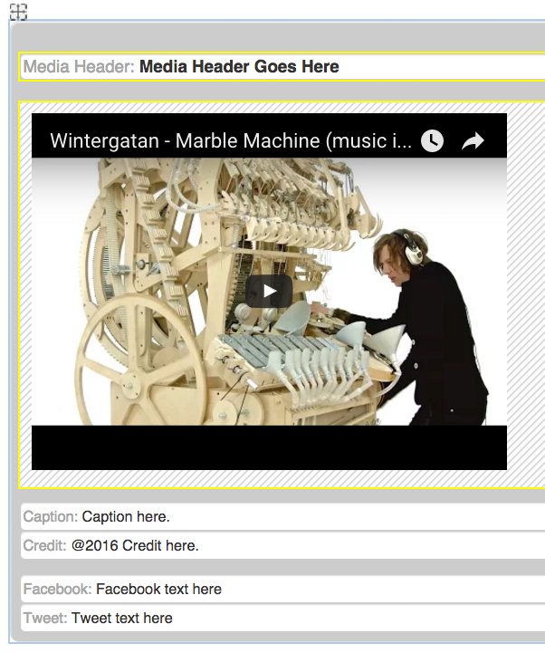
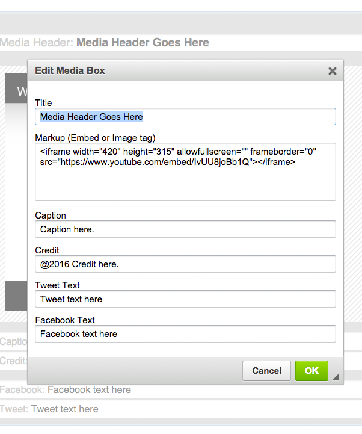

# ckeditor-mediabox

> Wrap your media up with a title, caption, credit, tweet and facebook text.

This CKEditor widget works as a simple embed plugin, but allows you to attach specific metadata to the media in a way that
is easily editable in the CKEditor editing pane.
 
## Installation

**Step 1:** Copy the mediabox plugin files to your CKEditor's plugin folder:
```
ckeditor/plugins/
```

**Step 2:** Add the plugin to the CKEDITOR configuration:
```js
CKEDITOR.config.extraPlugins = 'mediabox';
```

**Step 3:** Ensure that this plugin can create content:
```js
CKEDITOR.config.allowedContent = true;
```

**Step 4:** For best results, disable the default `iframe` plugin:
```js
CKEDITOR.config.removePlugins = 'iframe';
```

## Usage

Once installed, you can use the new Mediabox button in the Insert toolbar


This will allow you to embed an iframe, as well as set the title, caption, tweet text and facebook text directly in the editor.
Here is a preview of what the widget looks like in the editor.
 


Double-clicking on the widget will enable you to conveniently edit the contents through a form.
 


**Note:** The styles you see in the editor are only applied in the editor. The HTML output is not styled. 
           
## Output

This plugin wraps your media embeds with a very specific markup:

```html
<div class="media_widget">
    <h4 class="widget_h4_header">Media Header Goes Here</h4>
    <div class="media_embed">
        <iframe ...></iframe>
    </div>
    <div class="widgeticon">
	    <a href="#" class="fullIcon fancyboxlaunch fancybox.iframe"><i class="fa fa-arrows-alt"></i><span class="hidden"><!--ckeditor needs this span to make the widget work. facepalm.-->&nbsp;</span></a>
	    <a href="#" class="shareIcon social-btn sb-closed"><i class="fa fa-external-link-square"></i><span class="hidden"><!--ckeditor needs this span to make the widget work. facepalm.-->&nbsp;</span></a>
	</div>
	<div class="caption_credit">
	    <p>
	        <span class="caption">Caption text here.</span>
	        <span class="credit">Credit Text Here.</span>
	    </p>
	</div>
	<div class="socialbtns">
	    <span class="socialbtnsIcon"><i class="fa fa-facebook"></i><span class="facebook-text">facebook text here</span></span>
		<span class="socialbtnsIcon"><i class="fa fa-twitter"></i><span class="tweet-text">tweet text here</span></span>
	</div>
</div>
```

Use your own custom CSS to style the widget output anyway you like.

## License

MIT @ [Michael Wuergler](http://numetriclabs.com)
